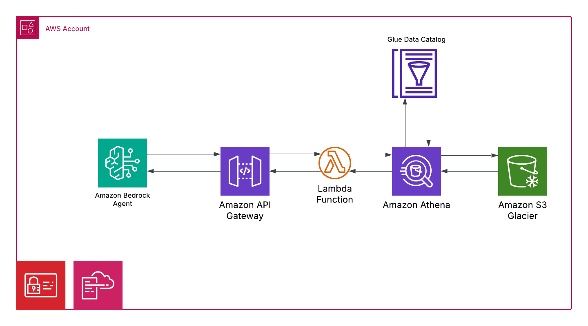

 # Lets Get Agentic - Create A Bedrock Agent to Query Athena # 

 # Introduction 

This GitHub Repo contains the code alongside explanations for this [youtube video](https://youtu.be/ZvJSaioPYyo). The setup work will create a s3 bucket, athena work group, set up the glue data catalog and create the tables. The api gateway and lambda function will be created to allow you to query the data using the bedrock agent. The video will show you how to create the agent and query the data using the aws console. 



# What's included

- [Set Up Work](#set-up)
- [Data](#datal)
- [Useful Links](#useful-link)
- [Creators](#creators)

# Data
Below is the schema for the table that wil be created in the Glue Data Catalog which includes a sample of the data.

**Customers**
| Customerid      | Firstname | Lastname| Fullname |
| ----------- | ----------- |-----------|-----------|
|  293 | Catherine                | Abel                   | Catherine Abel                 |
|  295 | Kim                      | Abercrombie            | Kim Abercrombie                |
|  297 | Humberto                 | Acevedo                | Humberto Acevedo               |

**Orders**

|  SalesOrderID |  SalesOrderDetailID |  OrderDate |  DueDate  | ShipDate | EmployeeID | CustomerID | SubTotal | TaxAmt | Freight | TotalDue | ProductID | OrderQty | UnitPrice | UnitPriceDiscount | LineTotal |
|---------------|---------------|---------------|---------------|---------------|---------------|---------------|---------------|---------------|---------------|---------------|---------------|---------------|---------------|---------------|---------------|
| 71782 | 110667 | 5/1/2014   | 5/13/2014  | 5/8/2014  | 276 |  293 |   33319.986 |  3182.8264 |  994.6333 | 37497.4457 | 714 |  3 |    29.994 |    0 |      89.982 |
| 44110 |   1732 | 8/1/2011   | 8/13/2011  | 8/8/2011  | 277 |  295 |  16667.3077 |  1600.6864 |  500.2145 |  18768.2086 | 765 |  2 |  419.4589 |    0 |    838.9178 |
| 44131 |   2005 | 8/1/2011   | 8/13/2011  | 8/8/2011  | 275 |  297 |  20514.2859 |  1966.5222 |  614.5382 |  23095.3463 | 709 |  6 |       5.7 |    0 |        34.2 |

**Employees**

| EmployeeID | ManagerID | FirstName | LastName | FullName  | JobTitle | OrganizationLevel | MaritalStatus  | Gender | Territory | Country | Group |      
|------------|------------|------------|------------|------------|------------|------------|------------|------------|------------|------------|------------|
| 276 |  274 | Linda   | Mitchell          | Linda Mitchell           | Sales Representative         | 3 | M | F | Southwest      | US   | North America |
| 277 |  274 | Jillian | Carson            | Jillian Carson           | Sales Representative         | 3 | S | F | Central        | US   | North America |
| 275 |  274 | Michael | Blythe            | Michael Blythe           | Sales Representative         | 3 | S | M | Northeast      | US   | North America |


Below is the schema for the customer table. 
```
    customerid  INT
    firstname   STRING
    lastname    STRING
    fullname    STRING
```


Below is the schema for the employees table. 
```
    employeeid        INT
    managerid         INT
    firstname         STRING
    lastname          STRING
    fullname          STRING
    jobtitle          STRING   
    organizationlevel INT
    maritalstatus     STRING 
    gender            STRING
    territory         STRING
    country           STRING
    group             STRING
```


Below is the schema for the orders table. 
```
salesorderid        INT
salesorderdetailid  INT
orderdate           STRING
duedate             STRING
shipdate            STRING
employeeid          INT 
customerid          INT 
subtotal            DOUBLE
taxamt              DOUBLE
freight             DOUBLE
totaldue            DOUBLE
productid           INT
orderqty            INT
unitprice           DOUBLE
unitpricediscount   DOUBLE
linetotal           DOUBLE
``` 

## Set Up Work 

1. Run the `create-s3-and-athena-bucket.yaml` located in the `cloudformation` folder to create the s3 bucket for the query results.
2. Uplaod the conents of the `s3-bucket-upload` folder to the s3 bucket. 
3. Run the following DDL in Athena to create the tables. Replace the bucket name with the name of the s3 bucket you created. 

    Create Customers Table
    ```
    CREATE EXTERNAL TABLE customers (
    customerid INT,
    firstname STRING,
    lastname STRING,
    fullname STRING
    )
    ROW FORMAT DELIMITED
    FIELDS TERMINATED BY ','
    STORED AS TEXTFILE
    LOCATION 's3://your-bucket/customers/'
    TBLPROPERTIES ('skip.header.line.count'='0'); 
    ```

    Create Employees Table
    ```
    CREATE EXTERNAL TABLE employees (
    employeeid INT,
    managerid INT,
    firstname STRING,
    lastname STRING,
    fullname STRING,
    jobtitle STRING,
    organizationlevel INT,
    maritalstatus STRING,
    gender STRING,
    territory STRING,
    country STRING,
    `group` STRING
    )
    ROW FORMAT DELIMITED
    FIELDS TERMINATED BY ','
    STORED AS TEXTFILE
    LOCATION 's3://your-bucket/employees/';
    ```

    Create orders table
    ```
    CREATE EXTERNAL TABLE orders (
    salesorderid INT,
    salesorderdetailid INT,
    orderdate STRING,
    duedate STRING,
    shipdate STRING,
    employeeid INT,
    customerid INT,
    subtotal DOUBLE,
    taxamt DOUBLE,
    freight DOUBLE,
    totaldue DOUBLE,
    productid INT,
    orderqty INT,
    unitprice DOUBLE,
    unitpricediscount DOUBLE,
    linetotal DOUBLE
    )
    ROW FORMAT DELIMITED
    FIELDS TERMINATED BY ','
    STORED AS TEXTFILE
    LOCATION 's3://your-bucket/orders/'; 
    ```

4. Run the `create-api-stack.yaml` file located in the `cloudformation` folder to create the api gateway and lambda function. 

5. The Youtube video will show you how to create the agent and query the data using the aws console. 

# Creators

**Johnny Chivers**

- <https://github.com/johnny-chivers/>

# Useful Links

- [youtube video](https://youtu.be/ZvJSaioPYyo) 
- [website](https://www.johnnychivers.co.uk)
- [buy me a coffee](https://www.buymeacoffee.com/johnnychivers)

Enjoy :metal: